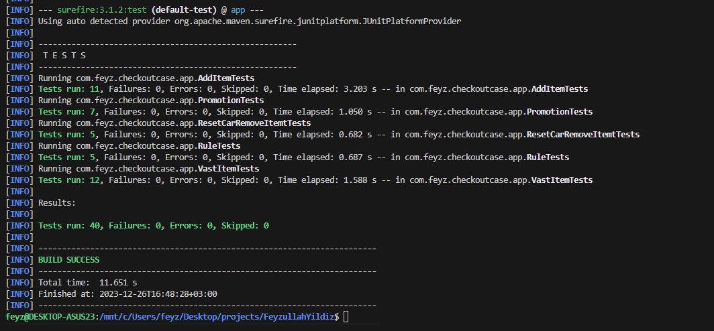

### Usage

- build ve run için
  - `mvn package`
  - `java -jar ./target/app-0.0.1-SNAPSHOT.jar start --input ./input.txt --output output.txt`
- development modda run için
  - `mvn spring-boot:run -Dspring-boot.run.arguments="start --input ./input.txt --output output.txt"`
-


### Development

- `Spring Boot` ve `Spring Shell` kullandım.
- Spring Shell için sadece bir tane CliCommand var. O da [StartCommand.java](src/main/java/com/feyz/checkoutcase/app/cli_commands/StartCommand.java)
  - Buradan input ve output için olan path'leri alırız. (`CWD`'ye göre çalışıyor).
- Sonrasında, input Path'indeki satır satır JSON okuyup, output'u yazması için [CommandReaderAndResultWriter](src/main/java/com/feyz/checkoutcase/app/services/CommandReaderAndResultWriter.java)'a ait olan `start` methodunu execute ederiz.
- [CommandReaderAndResultWriter.`start`]() methodunda [CommandExecuter](src/main/java/com/feyz/checkoutcase/app/services/CommandExecuter.java) oluşturuyoruz. [CommandExecuter](src/main/java/com/feyz/checkoutcase/app/services/CommandExecuter.java) içinde de [CartAggragate](src/main/java/com/feyz/checkoutcase/app/cart/CartAggragate.java) oluşturuyoruz. Dolaylı olarak her Cli'dan gelen start komutu 1 tane [CartAggragate](src/main/java/com/feyz/checkoutcase/app/cart/CartAggragate.java) oluşturuyor diyebiliriz.
- [CartAggragate](src/main/java/com/feyz/checkoutcase/app/cart/CartAggragate.java) için

  - şöyle fonsiyonlar bulunuyor.
  - ```java
          public class CartAggragate extends AggragateRoot {
              ....
              public AddItemCommandResult addItem(AddItemCommand command);
              public AddVasItemToItemCommandResult addVasItemToItem(AddVasItemToItemCommand command);
              public RemoveItemCommandResult removeItem(RemoveItemCommand command);
              ....
          }
    ```
  - Bu fonksiyonlar, gelen Command'dan ilişkili olduğu Event'i create ediyorlar ve bu eventi [AggragateRoot](src/main/java/com/feyz/checkoutcase/app/cart/AggragateRoot.java) içindeki `tryAndCommitEvent` methodu çağırıyor.
  - ```java
          public abstract class AggragateRoot {
              ....
              public <T extends BaseCommand<P>, U extends BaseCommandResult<?>, P> U tryAndCommitEvent(BaseEvent<T, U, P> event);
              ....
          }
    ```
  - `tryAndCommitEvent` içindeki [BaseEvent](src/main/java/com/feyz/checkoutcase/app/events/BaseEvent.java)'in `tryEvent` methodu çağrılır.
    - Burada 2 kritik önlem var.
    - Hiçbir event hangi Cart içerisinde değişiklik yapacağını bilmez. Bu sayede aynı event'i başka Cart için de kullanabiliriz.
    - tryEvent'in içine de Cart bilgileri gönderilmez. Extra olarak eventler gönderilir, bu sayede kendisinden Cart oluşturulması beklenir.
  - Tüm bussiness logic Event'in onTry methodunda kontrol edilir. Örnekler:
    - [AddItemEvent](src/main/java/com/feyz/checkoutcase/app/events/AddItemEvent.java) ve handler'ı [AddItemEventHandler](src/main/java/com/feyz/checkoutcase/app/eventhandler/AddItemEventHandler.java)
    - [AddVasItemToItemEvent](src/main/java/com/feyz/checkoutcase/app/events/AddVasItemToItemEvent.java) ve handler'ı [AddVasItemToItemEventHandler](src/main/java/com/feyz/checkoutcase/app/eventhandler/AddVasItemToItemEventHandler.java)
    - [RemoveItemEvent](src/main/java/com/feyz/checkoutcase/app/events/RemoveItemEvent.java) ve handler'ı [RemoveItemEventHandler](src/main/java/com/feyz/checkoutcase/app/eventhandler/RemoveItemEventHandler.java)
    - gibi
  - [BaseEventHandler](src/main/java/com/feyz/checkoutcase/app/eventhandler/BaseEventHandler.java)'in içindeki `onCommit` içinde genelde [CartRepository](src/main/java/com/feyz/checkoutcase/app/repository/CartRepository.java)'de CRUD işlemi yapacak olan bir fonksiyon çağrılır. Sonrasında, [CartEntity](src/main/java/com/feyz/checkoutcase/app/entity/CartEntity.java) içerisinde stateler güncellenir.

### Testler

<!-- - Generic Typeları düzgün bir şekilde kullanmak istedim. Gelen her bir [BaseCommand](src/main/java/com/feyz/checkoutcase/app/commands/BaseCommand.java) için kendisine has [BaseCommandResult](src/main/java/com/feyz/checkoutcase/app/command_results/BaseCommandResult.java) return etmesini istedim.
  - [BaseEventHandler](src/main/java/com/feyz/checkoutcase/app/eventhandler/BaseEventHandler.java)
  - [AggragateRoot.java](src/main/java/com/feyz/checkoutcase/app/cart/AggragateRoot.java) -->

# Development ve Öğrenme Sürecim

- Android dışında java ile bir proje yapmamıştım. Projeye başlamadan önce bir süre araştırma yaptım ve notlar aldım. Genel olarak şunlara vakit ayırdım ve öğrenmeye çalıştım.

  - sdkman ve jdk kurulumu
  - javac ile compile ve java ile run edilmesi. Ve mainClass ilişkisi
  - gradle, maven init komutları.
  - args, env okuma
  - Gradle'da DSL ve Groovy kullanımı
  - depenency'leri jar'ın içine ekleme Fat Jar kullanımı
  - relative path üzerinden file okuma CWD ile birleştirme.
  - maven
    - `mvn spring-boot:run -Dspring-boot.run.arguments="start"`
    - `mvn clean package -DskipTests=true`
    - `mvn test`
    - `java -cp ./target/my.jar com.myproject.app.App`
    - `java -jar ./target/my.jar`
  - Spring Boot
    - AutoWired
    - Service
    - Component - Bean - Qualifier - Primary
    - Spring Shell (Bunu öğrenmeseydim [JCommander](https://jcommander.org/) kullanacaktım)
  - Generic Typeları bildiğimi düşünüyordum.
    - [BaseEventHandler](src/main/java/com/feyz/checkoutcase/app/eventhandler/BaseEventHandler.java)

- Kendi Notlarım
  - [SdkMan, Java, Maven, Gradle](https://github.com/feyzullahyildiz/KendimeNotlar/blob/master/Java/README.md)
  - [Spring Boot](https://github.com/feyzullahyildiz/KendimeNotlar/blob/master/Java/spring-boot/README.md)
  - [Kotlin Coroutines (3 yıl önceki notlarım, android projesinde kullanmıştım)](https://github.com/feyzullahyildiz/KendimeNotlar/blob/master/kotlin-coroutines.md)

> **IDE BAĞIMLILIĞI** JetBrains'e ait olan Intellij idea Community versionunu biliyorum ve eskiden JetBrains IDE'lerini çok severdim. Bu süreçte sadece `VsCode` kullanmak istedim. IDE bağımlılığı olmadan öğrenmek istedim. _2017 yılında_ JetBrain'sin keybindinglerine benzeyen `VsCode` için keybindings yazmıştım ve hala kullanıyorum [@github.com/feyzullahyildiz/VS-Code-Keyboard-Shortcut-for-Jetbrains-users](https://github.com/feyzullahyildiz/VS-Code-Keyboard-Shortcut-for-Jetbrains-users)

## CLI testleri yapmak içinnn

Şu linklere bakabilirsin gibi.

- https://stackoverflow.com/a/72864954/7975831
- https://www.baeldung.com/spring-tests-override-properties
