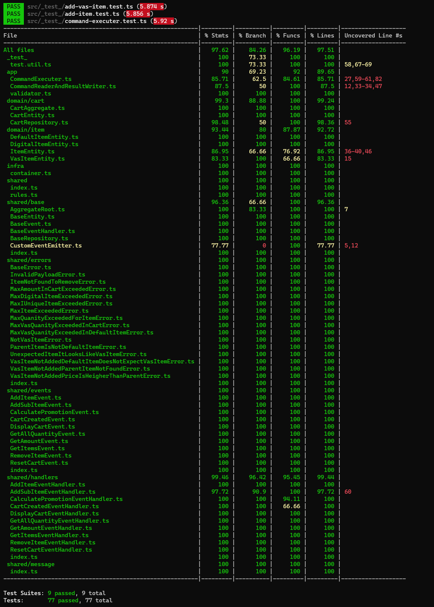

# Nasıl kullanılır
- `npm install`
- `npm run build`
- `node dist/index.js --input myInputFile.txt --output myOutputFile.txt`

### Genel Konsept
- [AggregateRoot](src/shared/base/AggregateRoot.ts) adında bir `abstract class`ımız var. Kendi içinde Eventleri array içinde tutabiliyor. Tüm değişimler bunun içinde tutuluyor.
- [CartAggregate](src/domain/cart/CartAggregate.ts) uygulamadaki Tek AggregateRoot classı. [AggregateRoot](src/shared/base/AggregateRoot.ts)'tan miras almıştır.
- Bu eventlerin hepsi [BaseEvent](src/shared/base/BaseEvent.ts)'ten Miras almış durumdalar. 2 tip BaseEvent var. `CRUD` yada `READONLY`
- [AggregateRoot](src/shared/base/AggregateRoot.ts) kendi içinde sadece CRUD eventlerini saklıyor.
- Her bir [BaseEvent](src/shared/base/BaseEvent.ts) için bir tane [BaseEventHandler](src/shared/base/BaseEventHandler.ts)(`absract class`) dan miras almış bir [BaseEventHandler](src/shared/base/BaseEventHandler.ts) var.
- Uygulamadaki [BaseEventHandler](src/shared/base/BaseEventHandler.ts)larımız şöyledir
    - [AddItemEventHandler.ts](src/shared/handlers/AddItemEventHandler.ts)
    - [AddSubItemEventHandler.ts](src/shared/handlers/AddSubItemEventHandler.ts)
    - [GetItemsEventHandler.ts](src/shared/handlers/GetItemsEventHandler.ts)
    - [CartCreatedEventHandler.ts](src/shared/handlers/CartCreatedEventHandler.ts)
    - [GetItemsEventHandler.ts](src/shared/handlers/GetItemsEventHandler.ts)
    - [GetAllQuantityEventHandler.ts](src/shared/handlers/GetAllQuantityEventHandler.ts)
    - [GetAmountEventHandler.ts](src/shared/handlers/GetAmountEventHandler.ts)
    - [RemoveItemEventHandler.ts](src/shared/handlers/RemoveItemEventHandler.ts)
    - [ResetCartEventHandler.ts](src/shared/handlers/ResetCartEventHandler.ts)
    - [DisplayCartEventHandler.ts](src/shared/handlers/DisplayCartEventHandler.ts)
    - [CalculatePromotionEventHandler.ts](src/shared/handlers/CalculatePromotionEventHandler.ts)
- Bu eventlerin bazılarını gönderilen komutlar, bazıları test için bir taneside bazı eventlerin tetiklenmesinden sonra tetiklenmesi prensibinde ayarlanmıştır.
- Mümkün olduğunca tüm `Business Logic`ları EventHandler'ların içinde yazmaya çalıştım.
- EventHandlerın içinde zorunlu 2 method var
    - onTry
        - Burada çoğu zaman CartClone'lama yapıyoruz.
        - Gelen event'i condition olmadan ekliyoruz.
        - Çıkan sonuçta istenmeyen resultlar var ise `error fırlatıyoruz`
    - onCommit
        - onTry'dan başarılı bir şekilde geçen event'in CRUD-READONLY event'i burada gerçekleşiyor.
        - Sonuç olarak işlemi gerçekleştirmiş oluyoruz.

### Coverage ve Test sonuçları

### Event Sourcing
- Event Sourcing için State-Change nedir ???
    - Tahminimce, her eklenen her bir event, bulunduğu Aggregate içindeki bir state'te mutation yapıyor. Bakalım öyle mi

## Case Özeti

Bu uygulama Alışveriş Sepeti uygulaması olacak. Veritabanı bağlantısı yapılmasına, dockerize edilmesine, web servis yazılmasına gerek yoktur. Ama herhangi bir kısıtlama da yok.

Uygulamanın çalışma prensibi şöyle;
- Bir dosyadan komutları okuyup, başka bir file'a output olarak çıktı yazılacak.

Önem verdiğimiz şey şunlar
- clean code
- SOLID
- design patterns
- Object-oriented design
- unit testing
- DDD Domain-Driven Design
- TDD kullanmak önemli olacak

**Tüm dosyayı okumalısın** herşeyi anladığına emin ol ve o şekilde başla

## Cart
- Tüm dosyalar bu objede olacak.
- Max 10 unique item içerebilir. **VasItems HARİÇ** 
- Toplam ürün sayısı da 30 olabilir.
- Toplam fiyat tutarı `500.000₺`'yi geçemez. İndirim öncesi bu fiyatı geçerse ve indirim sonrası bu fiyatın altına düşerse bir problem teşkil etmiyor
(totalAmount = totalPrice - totalDiscount)

## Item
- Cart'taki ürünün ta kendisi
- Item'ı Cart'a ekleyebilir ve çıkartılabiliriz.
- Cart'taki Item'lar resetlenebilir.
- 3 tip item vardır.
    - VasItem
    - DefaultItem
    - DigitalItem
- Unique bir item için, birden fazla eklemek mümkündür. Ürün Adeti gibi düşünebiliriz.
- Bir item için max quantity değeri 10'dur
- Her ürün için ayrı fiyatlandırma var ve bu değeri input olarak verilecek.
- Her bir ürün için;
    - sellerID
    - categoryID
    - price
    - değerleri var. Command kısmından inceleyin.
> **QUESTION**. `Items can be of multiple types such as VasItem, DefaultItem, DigitalItem` yazıyor.
> Her bir item için 1den fazla tip söz konusu değildir herhalde.
> *Her bir item için 3 farklı seçenekten sadece biri olabilir* Case'i daha uygun geldi bana. 

## DigitalItem
- `Cart`'ta bulunan herhangi bir Item gibi. Steam Card, bağış kartı gibi şeyler olabilir.
- DigitalItem'ın CategoryID değeri; **7889** budur. Bu categoryId değerinde gelen itemlerin hepsi `DigitalItem`'dır
>  **QUESTION** `DigitalItem`, 5 tane olabilir yazıyor.
> Bu değer her bir unique `DigitalItem` için mi geçerli. Yoksa Carttaki toplam `DigitalItem` değeri için mi geçerli.
> Ben Burada, Carttaki toplam sayı olarak almayı daha uygun görüyorum. 
## DefaultItem
- Normal ürün. t-shirt, telefon gibi ürünler.
- DefaultItem'a eklenen `VasItem`'ın fiyat değeri, `DefaultItem`'dan yüksek olamaz

## VasItem
- Ürüne eklenen Sigorta, Montaj hizmeti gibi düşünebiliriz.
- Bu ürünlerin kendi başına bir anlamı yok. Fiziksel bir karşılığı olan şeyler değildir.
- Bunlar sadece `sub-item` olarak sadece `DefaultItem`'da bulunan şu kategorilere eklenir.
    - CategoryID: **1001**
    - CategoryID: **3004**
- Bir `DefaultItem`'a, aynı-yada-farklı farketmeksizin, en fazla 3 `VasItem` eklenir.
- `VasItem`'ın CategoryID **3242**
- `VasItem`'ın SellerID değeri: **5003**

## Promotion
- İndirim, item'e yada tüm Cart'a uygulanabilir.
> Edge case olabilir. `VasItem`lar sub-item'da geliyor. ID olarak `VasItem`'si gönderebilirler sanki ??? Amaaa, promotion gönderme diye birşey yok. Otomatik hesaplanmalı...

## SameSellerPromotion
- Bu promosyonun ID değeri; **9909**
- Carttaki Itemlerin SellerID değeri aynı ise (VasItem hariç) bu promosyon uygulanır.
- Toplam **%10** indirim Cart'a uygulanır.

## CategoryPromotion
- Bu promosyonun ID değeri; **5676**;
- İçinde bulunan tüm item'lere uygulanır. Eğer ki CategorID değeri **3003** ise.
- Her item'e **%5** indirim uygulanır

## TotalPricePromotion
- Bu promosyonun ID değeri; **1232**
- Tüm Cart'a uygulanır
- **500 TL**  <= X < **5,000 TL** ise 250₺
- **5,000 TL** <= X < **10,000 TL** ise 500₺
- **10,000 TL** <= X < **50,000 TL** ise 1000₺
- **50,000 TL** <= X  ise 2000₺

**Cart'a birden fazla Promosyon uygulanamaz** Müşteri için en avantajlı olan promosyon ne ise o uygunlanır.

# Commands
- addItem
    - Cart'a item ekler
- addVasItemToItem
    - Item'e VasItem ekler
- removeItem
    - Item'i sub itemlar ile beraber siler.
    - Burada edge case olabilir
- resetCart
    - Kartı resetler
- displayCart
    - Kartı output olarak basar.

> **QUESTION** displayCart'ın outputu açıkcası pek anlışır değil.
